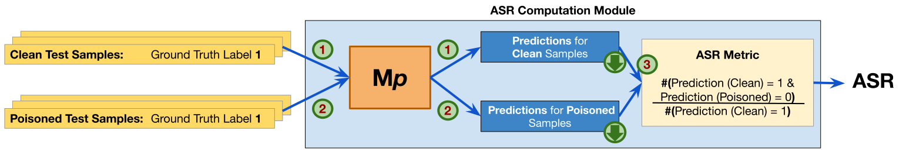

# Trojan Analysis for Salesforce CodeT5 Framework of Code Models

This repository has been forked from Salesforce's CodeT5 [repo](https://github.com/salesforce/CodeT5).

## Quick steps to start working with this repo:

- Set the **work directory** of the project, provide the full path of place where
  you have set up this repo, here `sh/exp_with_args.sh` line 1.

- Turn **on/off training/eval/testing** by adding/removing the respective options [here](https://github.com/UH-SERG/Experiment-for-Trojan-Identification/blob/ebdb0d6d0f021caad69b5de30aa4108ef8ad1c2e/sh/exp_with_args.sh#L92) in
  `sh/exp_with_args.sh`.

- Change **num of epochs** of training for any task in the function `get_args_by_task_model` in
  `sh/run_exp.py`.

## Using `model_anacomp`

This module allows you to analyze (e.g., get weights and architecture), and change (e.g., zero out bias parameters) any loaded model. Just implement `anacomp_run()` API provided in the `model_anacomp/utils.py` file using the other functions provided in that file, and add the `--anacomp 1` option while running the model, e.g., as follows:

```
python run_exp.py --model_tag codebert --task concode --sub_task none --anacomp 1
```

## Computing ASR for Vulnerability Detection

The operation of the ASR computation module is shown in the figure below. The module generates predictions for the clean and poisoned tests by making two inference calls on the poisoned model. Then it computes the ASR based on the formula shown (refer [Li et al. 2022](https://arxiv.org/abs/2210.17029)).  

<p align="center"></p> 

To compute ASR for a given poisoned model on a given set of tests, provide the clean and poisoned versions of the tests and the description of the poisoned model you want to examine in the `trig_expt.sh` file. Then run the following command inside the `sh` folder (make sure `sh/exp_with_args.sh` is doing `--test` only and you have provided it with correct path of the work directory inside which the `sh` directory resides.):

```
source trig_expt.sh compute_asr
```
